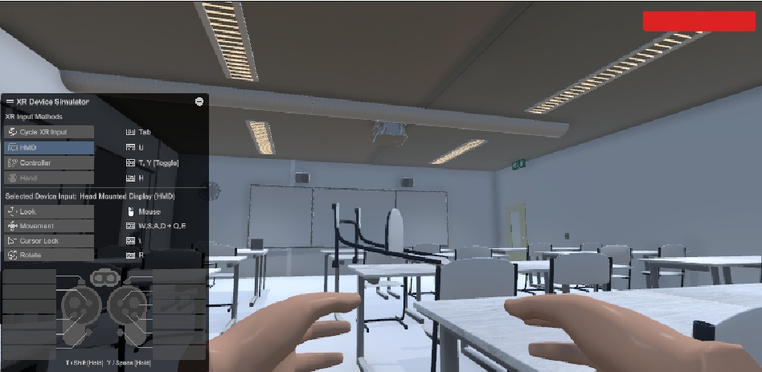
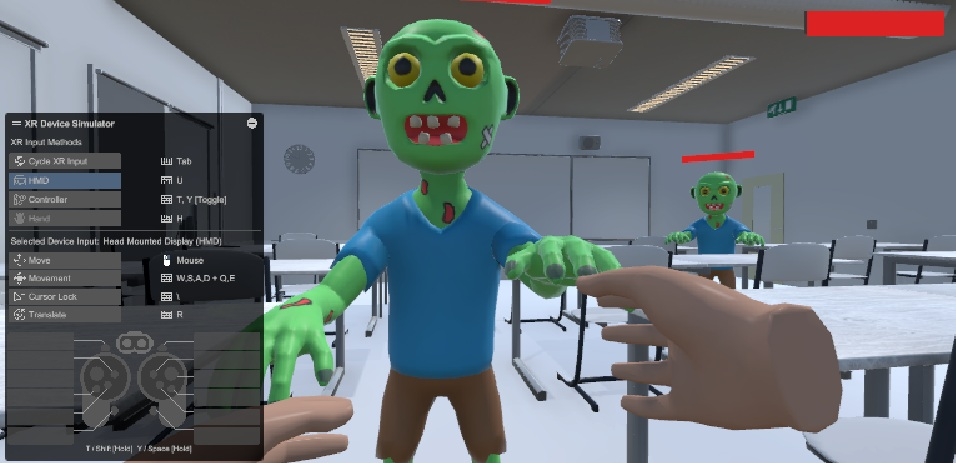
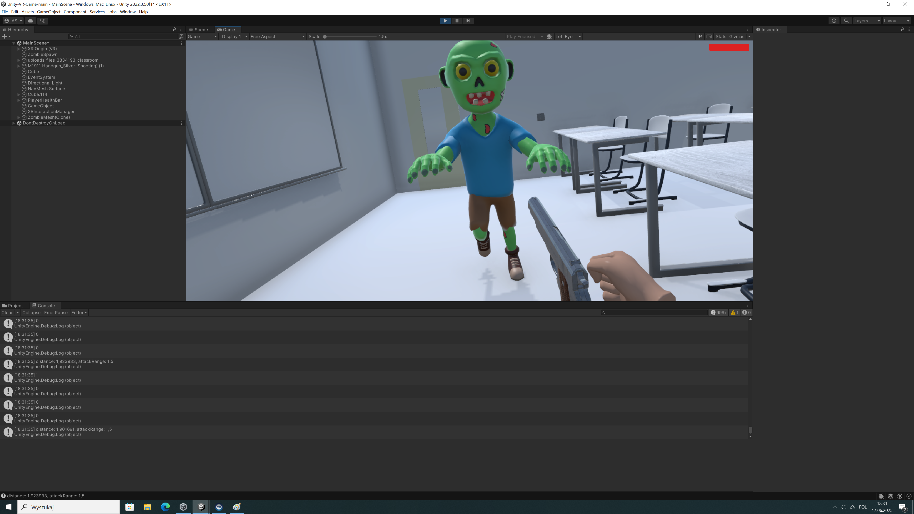

# VR Survival Simulation (Unity XR)

Dwuosobowy projekt symulacji wirtualnej rzeczywistości (VR) typu First-Person Shooter, zrealizowany w silniku **Unity 2022**. Aplikacja wykorzystuje framework **XR Interaction Toolkit** do obsługi interakcji fizycznych oraz zaawansowaną mechanikę poruszania się w przestrzeni 3D.

Celem projektu było zgłębienie technologii VR, programowania logiki w języku C# oraz optymalizacji wydajności graficznej dla gier czasu rzeczywistego.

---

## Galeria

 
 

---

## Technologie i Narzędzia
* **Silnik:** Unity 2022.3 (LTS)
* **Język:** C# (Skrypty logiczne)
* **Framework VR:** XR Interaction Toolkit / OpenXR
* **AI:** Unity NavMesh (Pathfinding dla przeciwników)
* **Narzędzia:** XR Device Simulator (do testowania bez gogli)

## Główne Funkcjonalności
1.  **Pełna immersja VR:** Obsługa śledzenia ruchu głowy (HMD) i kontrolerów ręcznych.
2.  **Fizyka interakcji:** Możliwość podnoszenia przedmiotów (Grab Interactables), obsługi broni i fizyki pocisków.
3.  **Sztuczna Inteligencja (AI):** Przeciwnicy (Zombie) wykorzystują algorytm NavMesh Agent do omijania przeszkód i śledzenia gracza w zamkniętym pomieszczeniu.
4.  **Zarządzanie stanem gry:** System punktów życia, respawn przeciwników i obsługa zdarzeń (Events).
